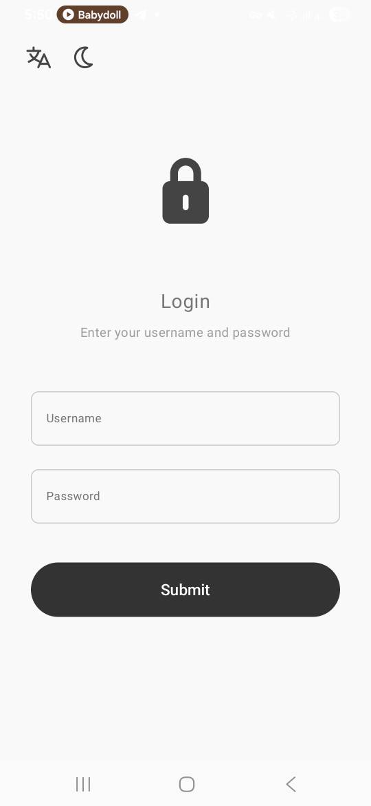
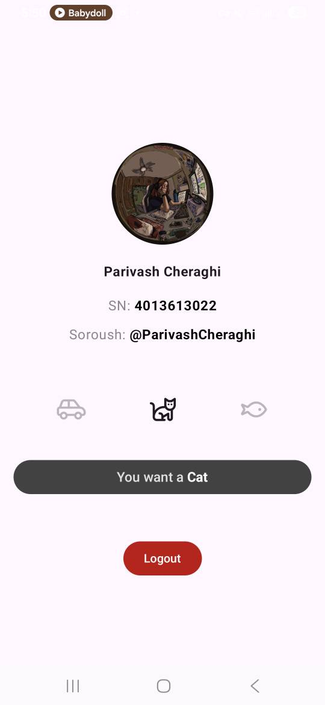

# android login dashboard app

A simple Android application developed as part of an Android Programming course project.

## Features

* 🔐 User authentication with username and password
* 💾 Local data persistence using DataStore
* 🌐 Language switching (English / Persian)
* 🌙 Dark Mode support
* 📱 Modern Android UI with Jetpack Compose
* 🐱🚗🐟 Interactive dashboard with Cat, Car, and Fish actions
* 🔄 Dynamic button text updates based on user selection

## Technologies

* Kotlin
* Jetpack Compose
* Android DataStore
* Material Design 3

## Screenshots
<table>
  <tr>
    <td align="center" style="padding:10px">
      <b>Login Screen</b><br>
      
    </td>
    <td align="center" style="padding:10px">
      <b>Dashboard Screen</b><br>
      
    </td>
  </tr>
</table>

## Project Structure

```text
app/
├── src/
│   ├── main/
│   ├── java/
│   └── res/
├── build.gradle.kts
└── proguard-rules.pro
```

## How to Run

1. Clone the repository

```bash
git clone https://github.com/your-username/android-login-dashboard-app.git
```

2. Open the project in Android Studio

3. Sync Gradle files

4. Run the application on an emulator or Android device

## Features Demonstrated

* Login navigation flow
* State management
* DataStore preferences
* Theme switching
* Localization (EN/FA)
* Interactive UI components

